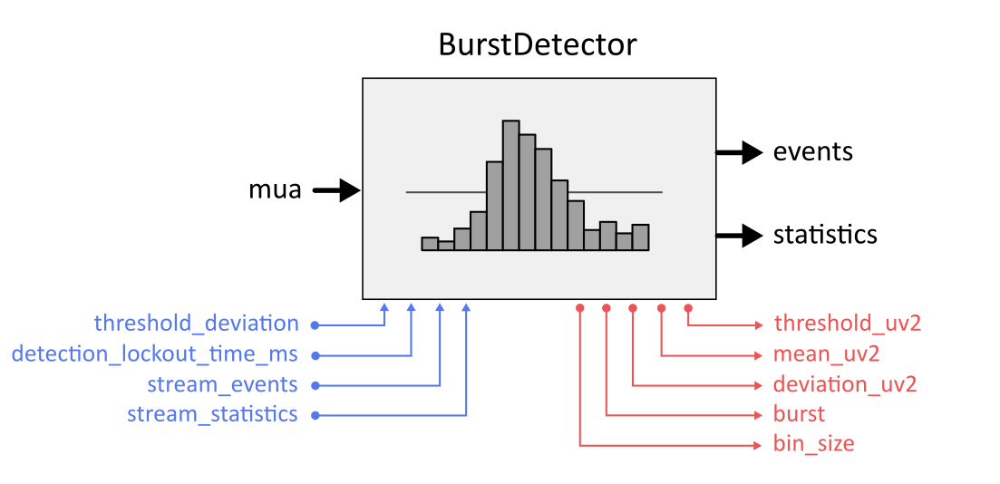

BurstDetector
-------------
Detect population bursts using a threshold crossing algorithm.

.. tabularcolumns:: |p{2cm}|p{2cm}|p{1cm}|p{7cm}|

.. list-table:: **Input port**
   :header-rows: 1
   :class: longtable

   * - port name
     - data type
     - slots
     - description
   * - **mua**
     - :ref:`MUAData`
     - 1
     - Binned multi-unit activity in Hz (e.g. from MUAEstimator).

.. tabularcolumns:: |p{2cm}|p{3cm}|p{1cm}|p{8.5cm}|

.. list-table:: **Output port**
   :header-rows: 1

   * - port name
     - data type
     - slots
     - description
   * - **events**
     - :ref:`EventData`
     - 1
     - A stream of 'burst' events.
   * - **statistics**
     - :ref:`MultiChannelData` <double>
     - 1
     - A stream of nsamples-by-2 arrays with the signal test value (first column)
       and the threshold (second column). The number of samples in each statistics
       data packet is set by the statistics_buffer_size option.

.. tabularcolumns:: |p{4cm}|p{1cm}|p{1cm}|p{8.5cm}|
.. list-table:: **Options**
   :header-rows: 1

   * - port name
     - data type
     - default
     - description
   * - **threshold_dev**
     - double
     - 6.0
     - for threshold multiplier. Units: signal standard deviations.
   * - **smooth_time**
     - double
     - 10.0 sec
     - integration time for signal statistics. Must be a positive number (sec).
   * - **detection_lockout_time_ms**
     - double
     - 30 ms
     - refractory period after threshold crossing detection that is not considered for updating of statistics
       and for detecting events. Must greater than 0 ms.
   * - **stream_events**
     - bool
     - True
     - enable/disable burst event output
   * - **stream_statistics**
     - bool
     - True
     - enable/disable streaming of burst detection statistics
   * - **statistics_buffer_size**
     - double
     - 0.5 sec
     - Buffer size (in seconds) for statistics output stream. This value determines
       the number of samples that will be collected for each data packet streamed
       out on the statistics output port. must be either equals or greater than 0.

.. tabularcolumns:: |p{4cm}|p{1cm}|p{3cm}|p{1.5cm}|p{1.3cm}|p{3cm}|

.. list-table:: **Writable States**
   :header-rows: 1

   * - name
     - data type
     - initial value
     - external access
     - peers access
     - description
   * - **threshold_uv2**
     - double
     - 0.0
     - read-only
     - read-only
     - Current threshold that needs to be crossed
   * - **mean_uv2**
     - double
     - 0.0
     - read-only
     - read-only
     - Current signal mean. Units: same as input signal.
   * - **deviation_uv2**
     - double
     - 0.0
     - read-only
     - read-only
     - Current signal deviation. Units: same as input signal.
   * - **burst**
     - bool
     - False
     - read-only
     - read-only
     -

.. tabularcolumns:: |p{4cm}|p{1cm}|p{3cm}|p{1.5cm}|p{1.3cm}|p{3cm}|

.. list-table:: **Readable States**
   :header-rows: 1

   * - name
     - data type
     - initial value
     - external access
     - peers access
     - description
   * - **bin_size**
     - double
     - 1.0
     - read-only
     - read/write
     -
   * - **threshold_deviation**
     - double
     - option: threshold_deviation
     - read-only
     - read/write
     -
   * - **detection_lockout_time_ms**
     - double
     - option: detection_lockout_time_ms
     - read-only
     - read/write
     - Current refractory period following threshold crossing that is not
       considered for  updating signal statistics and for event detection.
   * - **stream_events**
     - bool
     - option: stream_events
     - read-only
     - read/write
     -
   * - **stream_statistics**
     - bool
     - option: stream_statistics
     - read-only
     - read/write
     -

