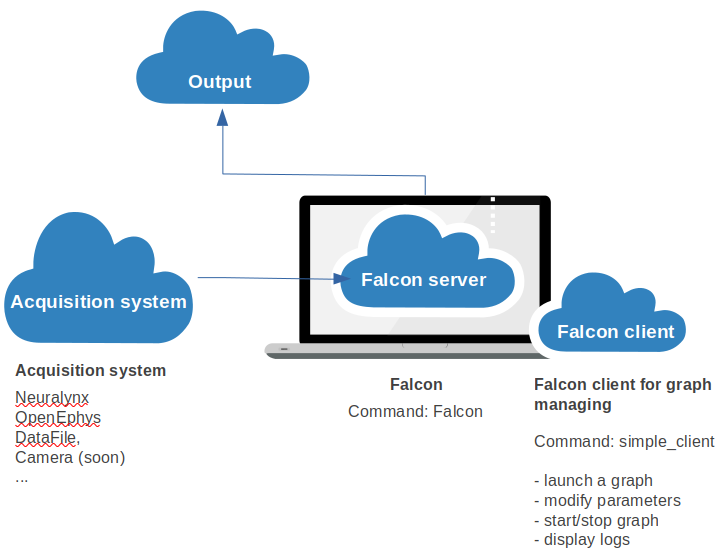

.. Falcon documentation master file, created by
   sphinx-quickstart on Fri May  5 15:12:39 2017.
   You can adapt this file completely to your liking, but it should at least
   contain the root `toctree` directive.

.. raw:: html

    

************************
Documentation for Falcon
************************

Falcon is a software for real-time processing of neural signals to enable
short-latency closed-loop feedback in experiments that try to causally link
neural activity to behavior. Example use cases are the detection of hippocampal
ripple oscillations or online decoding and detection of hippocampal replay
patterns.

*******************
High-Level overview
*******************

At its core, Falcon executes a user-defined data flow graph that consists of
multiple connected nodes (processors) that perform computations on one or more
streams of input data and produce one or more streams of output data. Some
types of processors produce output data without accepting input data
(sources), whereas other types of processors consume input data without
produce output data (sinks).

The data flow graph is specified in YAML text format and defines all the
processor nodes and their interconnections. Falcon ships with a number of
built-in processors that can be used to construct custom applications. Falcon can be
easily extended with new kinds of processors, although this requires modern C++
programming skills (see :ref:`overview_extensions`).

By design, Falcon software is only concerned with the execution of data flow
graphs and it does not include a graphical user interface. Rather, separate
client applications interact with a running Falcon instance through network
communication. In this way, dedicated  user interfaces may be built in any
programming language for particular user applications (as determined by the
data flow graph). A generic Python control client is shipped with Falcon (see
:ref:`generic_client`) and serves as an example for how to build a user interface.

        (Neuralynx, Open-Ephys, datafile, Camera) in input and the output (arduino, digital hardware) while being controlled by a falcon client.

.. rst-class:: clearfix row

Work with Falcon
................

.. rst-class:: clearfix row

.. rst-class:: column column3

`Install Falcon <installation.html>`_
-------------------------------------

Installation guides for a `user  <manual/binary_installation.html>`_
or for a `developer <manual/installation.html>`_ of Falcon.

.. rst-class:: column column3

`User Guide <user_guide.html>`_
-------------------------------

Practical step-by-step to `run Falcon <manual/usage.html>`_,
`setup a graph <manual/graphs.html>`_ and `configure the server <manual/configuration.html>`_ for the first time.

.. rst-class:: column column3

`Falcon Client  <client.html>`_
-------------------------------

Install and use the `Fklab Falcon Client  <ui/generic_control.html>`_ or `create  <ui/create_ui.html>`_ your own client.

.. rst-class:: clearfix row

Develop Falcon
..............

.. rst-class:: clearfix row

.. rst-class:: column column3

`Developer's guide <dev_guide.html>`_
-------------------------------------

Overview of every components of Falcon-core:

- `command  <internals/command_system.html>`_ and `logging system <internals/logging_system.html>`_
- `configuration system  <internals/config_system.html>`_
- `graph system  <internals/graph_system.html>`_
- `utilities  <internals/utilities.html>`_

.. rst-class:: column column3

`Extending Falcon  <extending_falcon.html>`_
--------------------------------------------

Falcon can be extended with new set of processors and datatype. See how you can `create your own <extensions/extend_processor.html>`_.

.. table:: Existing extensions
   :widths: auto

   =============================================================== ==================================================================================== ============
                             Name                                                            Repository                                                     Public
   =============================================================== ==================================================================================== ============
   `fklab <https://falcon-fklab-extensions.readthedocs.io>`_       `source code <https://bitbucket.org/kloostermannerflab/falcon-fklab-extensions>`_    True
   `behavior <https://falcon-behavior-extensions.readthedocs.io>`_ `source code <https://bitbucket.org/kloostermannerflab/falcon-behavior-extensions>`_ False
   `decoding <https://falcon-decoding-extensions.readthedocs.io>`_ `source code <https://bitbucket.org/kloostermannerflab/falcon-decoding-extensions>`_ False (soon)
   =============================================================== ==================================================================================== ============

.. rst-class:: column column3

`Reference API  <api/library_root.html>`_
---------------------------------------------------

Doxygen documentation automatically generated from the code.

.. rst-class:: clearfix row

Indices and tables
..................

.. rst-class:: clearfix row

.. rst-class:: column column3

`Complete table of contents <content_table.html>`_

.. rst-class:: column column3

:ref:`search`

.. rst-class:: column column3

`Reporting bugs or Enhancement proposals <https://bitbucket.org/kloostermannerflab/falcon-core>`_

.. rst-class:: clearfix row

.. _`Kloosterman Lab`: http://kloostermanlab.org
.. _NERF: http://www.nerf.be

.. toctree::
    :maxdepth: 1
    :hidden:

    content_table
    installation
    user_guide
    client
    dev_guide
    extending_falcon
    api/library_root