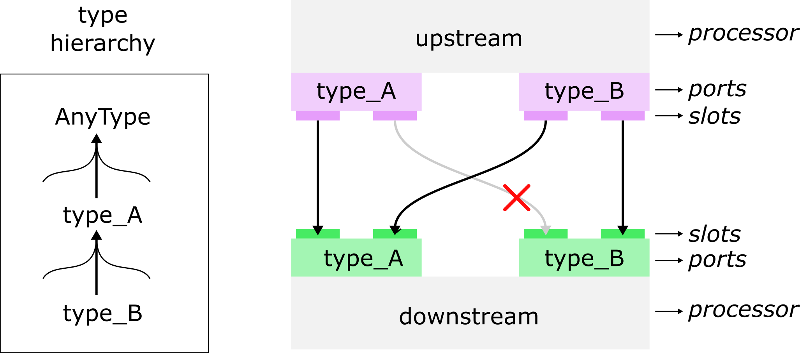
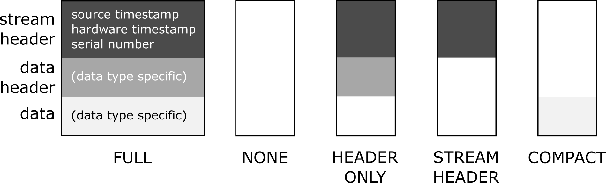

Stream dataflow
===============

Data types
----------

Data flows between two processors from an output port on the upstream (sending) processor to an input port
on the downstream (receiving) processor. Ports have one or more slots that form the actual data transport paths.
Slots are independent data channels, but they share a few properties by virtue of being part of the same port.
Most notably, all slots on a port send or receive the same type of data, for example event data or timeseries data.

The data type is an important concept in falcon. All input/output ports on processors are associated
with a particular data type, and an output-input port connection can only be made if their data types are compatible (
see below for how compatibility is checked).

This means that if a processor generates or accepts multiple data streams that represent different types of information,
it will need multiple input/output ports dedicated to each data stream. On the other hand, if a processor generates or
accepts multiple (possibly a variable number of) data streams that carry the same type of data, the processor will generally
have one input/output port for this data type with multiple slots for the data streams.

|

   Rationale for using a data type system: it provides flexibility in expressing what kind of data is produced
   in the graph with specialized data classes that provide convenient methods to manipulate that data and
   it lets falcon check at run time if connections are allowed and provide early and informative error messages.
|

The data stream between processors consists of a circular buffer of data objects that are repeatedly filled with new data
by upstream processors and continuously read by downstream processors.
(Note that data objects are reused and only created/initialized when the processing graph is constructed and deleted
when the graph is destroyed.)

A data type indicates what is represented in a data object and how the user intends to use the data.
Data objects generally have methods to set and get the data that is stored in the object.
As an example, event data type refers to data objects that store the name of an event and the time at which the event occurred.

Data types form a hierarchy with at the base of the hierarchy the generic AnyType data type.
The data object associated with the AnyType data type is implemented in the Data class, which is the base class of all
other more specialized data objects. The Data class provides three pieces of information:

- source timestamp – time at which data object was produced by the upstream processor
- hardware timestamp – time at which data was generated by external hardware
- serial number – serial number of the data object

Note that in the code, data types are described by classes (such as the AnyType class) that are just containers
for the data object class and associated parameter and capabilities classes, plus static member functions
for the name of the data type and a label for the data. And while there is an inheritance hierarchy for the data object classes,
there is no explicit hierarchy for the data type classes. See also “Template for implementing a new data type”)

Parameterization of data objects
--------------------------------

Data objects may be parameterized to provide additional control over the stored data.
For example, for timeseries data objects that store multi-channel signals, one parameter could control the number of channels
that the data objects store internally. The parameterization is applied at the level of output ports,
but parameters can be customized for each slot (see below). The parameters are set during construction of the data objects.
Note that parameters cannot be set for input ports because they receive whatever is streamed from the upstream output port.

Data type capabilities
----------------------

It is often useful to be able to restrict the data object parameterizations that an input port on a processor can handle.
This can be done by defining capabilities for a data type. For example, the number of channels in a multi-channel
timeseries data type may be restricted to a predefined range of values.

Capabilities are defined in a data type specific class. Capabilities classes provide a single Validate method to validate
incoming data objects against the capabilities. Capabilities are defined at the level of input ports and all slots
on a port share the same capabilities.

Data serialization
------------------

It is often desirable to save streams of data objects to disk or to another process over the network.
Falcon supports such serialization of data streams through a set of serializer classes. The information to be serialized
ranges from stream-specific information to a description of the data inside data objects and the data itself.

Serializers and encoding
************************

The data to be serialized must first be converted to a byte representation according to an encoding scheme.
Three encodings are current implemented in falcon: BINARY, YAML and FLATBUFFER. For each of the encodings,
a subclass of the base Serializer class mediates the serialization process through the overloaded Serialize method.

**BinarySerializer**: this class encodes data into a simple binary representation of elementary data types (e.g., integers, floats, etc).
However, to read the data one needs to know the data schema which is not included in the data itself.

**YAMLSerializer**: this class encodes data into YAML as a (nested) set of key/value pairs. The size of the encoded data is larger
than the binary encoding, but the output is human readable and does not require a separate schema.

**FlatBufferSerializer**: this class encodes data into a FlatBuffer schema separated in two parts:

- A fixed part common to all datatypes defined in datatype.fbs

.. code-block::

    table DataSource {
      processor: string;
      port: string;
      slot: uint8;
      streamid: uint16;
    }

    table RootMsg {
      version: string;
      packetid: uint32;
      source: DataSource;
      type: string;
      data: [ubyte] (flexbuffer);
    }

- A flexbuffer part defined at build time in each datatype serialization specialization.

.. note:: the schema is stored in the code as a fbs file and is generated as header file by flatc at built time.

Data type specific serialization
********************************

The data object class that is associated with a data type is responsible for serializing its own data.
To support an encoding, a data object class overloads the corresponding serialization method: SerializeBinary, SerializeYAML or SerializeFlatBuffer.
Within these methods, the requested data is serialized according to the desired serialization format (see below).
Note that it is important that the implementation of a serialization method first calls the base class implementation.

Serialization format
********************

We define three pieces of information that each data object could serialize: 1) the source timestamp,
hardware timestamp and serial number from the base DATA class; 2) data type specific metadata and 3) data type specific data.
To control which data inside data objects is serialized, falcon defines several serialization formats:
NONE, FULL, HEADERONLY, STREAMHEADER and COMPACT.

|

   Data object serialization formats
|