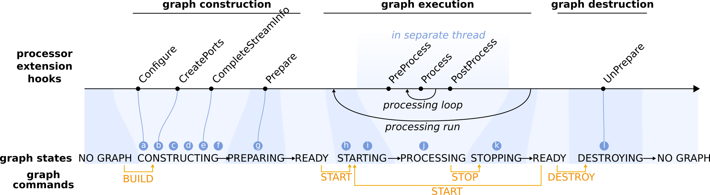

Graph life cycle
================

|

|

#. **Construction of processor nodes.**
    Processor nodes are constructed by a factory that has a registry which maps processor names to the associated processor class.
    The factory calls the constructor which define the available option values, customized for each processor.

#. **Configuration of processor nodes.**
    The IProcessor base class will take care of parsing the user options defined in the graph definition, validated their values
    and store it for future use.  Then, the IProcessor base class will call the Configure hook that provides
    processor extensions a mechanism for initialization immediately after construction. It is generally used to fine tune
    the loading/parsing/configurate options step when the option library implementation is too limited to do it directly.

#. **Creation of input/output ports and shared states.**
    In the next step after construction and configuration, processor nodes can create the input and output ports
    for handling streaming data, and states for sharing variables. Processor extensions should overload the CreatePorts hook
    and use the available convenience methods to create the ports and states (create_output_port, create_input_port,
    create_readable_shared_state and create_writable_shared_state). Often a pointer to the port or state is stored for
    future use (this is convenient, although not strictly necessary). If the user has explicitly specified ring buffer
    sizes for the output ports in the advanced options, these will be applied immediately after all ports have been created.
    The data packets that stream from output to input ports carry specific types of data,
    and each input/output port will only handle the one data type that was specified during creation.

#. **Connecting processor nodes.**
    For each connection, a point of contact (slot) is created on the corresponding output/input ports.
    Connections between upstream (output) and downstream (input) ports are established after the downstream and
    upstream addresses (i.e., processor name, port name and slot number) of the connection are completed.
    This means that the default input/output port is set if the address has no port specified. And if no slot number is provided,
    then the next available slot is reserved.

    Connected output/input slots store a link to each other. Note that input slots can only receive a connection
    from a single output slot, but output slots can be connected to many downstream input slots.

    Output slots maintain a stream information object to keep track of the specific data parameters for that slot.
    These parameters are initially set to the parameter values stored by the parent port (see step 3).
    All input slots on a single input port share the same capabilities as the parent pot.

#. **Linking shared states.**
    Processor state values are linked (i.e., the states share a single value) and optionally exposed to the external
    world in the form of a state alias to allow users to read or change the state value while the graph is executing.

#. **Negotiation and validation of streaming data connections.**
    Negotiation of the data streams between processors starts with the upstream processor finalizing the data parameters
    and expected stream rate for each of its output slots. Processor implementers may use the CompleteStreamInfo hook
    to override the default parameters and stream rate. Once the stream information is finalized,
    the output slots use the final parameters to construct a prototype data object.

    Next, the downstream processor requests the prototype data object and checks that its data type is compatible
    with the data type of the receiving input slot. Compatibility requires that the data type of the data objects generated
    upstream are the same or more specialized than the data type of the input slot. The downstream processor further
    validates the prototype data object against the capabilities of the input slot. Finally, the downstream processor
    has all necessary information about the incoming data streams to finalize the stream information of its own output slots
    (i.e., using the CompleteStreamInfo hook).

    In the CompleteStreamInfo hook (as well as later Prepare and (Pre)Processing hooks), one often needs access
    to the stream information, such as the data parameters that were used to initialize the data objects.
    However, direct access to the parameters object is not possible, because parameter classes are data type specific
    and they do not form a parallel class hierarchy with the data objects, and the downstream slot does not know
    the exact data type of the upstream slot. The prototype data object is guaranteed to be a more specialized type
    than the input data type and can thus be upcast to an input type data object. Thus, input slots have access to the properties
    of the upcast data object. In case a parameters object is needed downstream (e.g., to copy input parameters to the output
    within a processor), then the only way is through the parameters method of the upcast prototype data object.

    During the negotiation process it is also checked that input and output slots are all connected. Dangling (non-connected)
    input slots are not allowed and will trigger an error. Dangling output slots are acceptable and only trigger a warning.

#. **Creation of ring buffers.**
    A fixed number of data objects are constructed based on the prototype data object in the stream information object
    of the output slot (see step 6). The data objects are stored in a ring buffer in the output slot.

#. **One-time preparation of processor nodes.**
    The final step in building a graph is to give processor nodes the opportunity to perform preparations,
    such as resource allocations, file I/O or CPU intensive operations, that only have to be done once in the processor lifetime.
    Processor extensions can use the Prepare hook for this purpose.

#. **Preparing processor nodes and their ports for graph execution.**
    Prior to execution of a graph, all processor nodes and their ports (in particular the ring buffers) are prepared
    internally and reset to their initial state.

#. **Start threads for processor nodes.**
    Next, the dedicated thread for each processor node is started.

#. **Run processing loop.**
    The process loop only starts after *all* processor nodes have finished PreProcess-ing.

    |
    .. figure:: ../images/processor_lifecycle.png
        :alt: Schema describing data exchange between processors with the help of a ringbuffer
        :scale: 50 %

        Data exchange between processors with the help of a ringbuffer based on disruptor library.
        For cursor reada, RetrieveData(2, data) will retrieve pointers to the data packets at positions 5 and 6.
        A subsequent call to ReleaseData() will move the cursor two positions ahead and make positions 5 and 6 available for writing.
        Note that the read cursor that lags behind the most will determine to what position the write cursor can move.

        ClaimData() will return a pointer to the next available data packet, in this case at position 17.
        A subsequent call to PublishData() will advanced the write cursor and make the data at position 17 available to the read cursors.

    Each of the processing loop is specialized for each type of processors. For more information, look into
    `Create new processor <../extensions/extend_processor.html>`_

#. **Terminate processing loop.**

#. **Clean up of processor nodes and destruction of graph.**
    Before all graph elements are destructed, processor nodes have the ability to release resources that were previously
    acquired in the Prepare hook, by overloading the UnPrepare hook.

