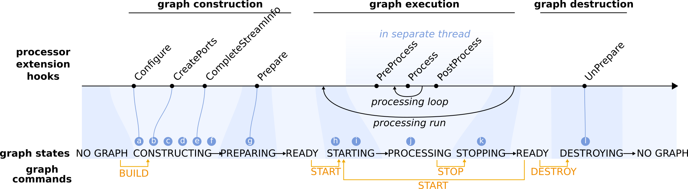
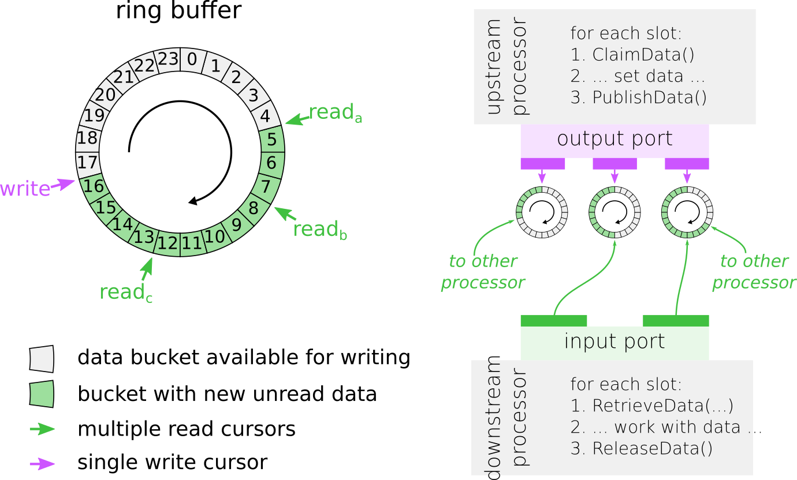

Graph life cycle
================
|

|

**a. Construction and configuration of processor nodes.**
    Processor nodes are constructed by a factory that has a registry which maps processor names to the associated processor class. The factory calls the default constructor and it is convention that processor extensions do not overload the default constructor. Rather, initialization and configuration of a processor node is done in a separate step. The IProcessor base class will call the Configure hook that provides processor extensions a mechanism for initialization immediately after construction. The YAML user options are passed into the Configure hook, and most processor extensions will parse the options, validate their values and store the option values for future use. The IProcessor base class will take care of the advanced options (i.e. options.test and all advanced options).

**b. Creation of input/output ports and shared states.**
    In the next step after construction and configuration, processor nodes can create the input and output ports for handling streaming data, and states for sharing variables. Processor extensions should overload the CreatePorts hook and use the available convenience methods to create the ports and states (create_output_port, create_input_port, create_readable_shared_state and create_writable_shared_state). Often a pointer to the port or state is stored for future use (this is convenient, although not strictly necessary). If the user has explicitly specified ring buffer sizes for the output ports in the advanced options, these will be applied immediately after all ports have been created. The data packets that stream from output to input ports carry specific types of data, and each input/output port will only handle the one data type that was specified during creation.

**c. Connecting processor nodes.**
    For all the connections specified in the graph definition, a link is made between the involved output and input ports. In most cases, a slot on the in/output port is automatically created when a connection is made, which makes is easier to make multiple connections with the same ports. Connections between ports are only established after a compatibility check, i.e. the input port should be able to handle the type of data packets that are produced by the output port. This either means that the output port produces data packages of the same type as the input port or a more specialized (derived) data type. In addition, data types can be parameterized, and the specific parameters set on the output port data stream should be compatible with (i.e. within the range of) the capabilities of the input port.

**d. Linking shared states.**
    The next step links processor states that should be shared between multiple processor nodes. Optionally, shared states are made accessible to the user through a dedicated name (alias). States can only be linked if they support the same data type and if their access permissions are compatible.

**e. Negotiation and validation of streaming data connections.**
    In this step, the specific parameters (i.e. stream rate and data type specific parameters) of the output data streams are finalized. Processor extensions can overload the CompleteStreamInfo hook to customize this step. For each input slot, a validation step is performed to make sure parameters of incoming data are compatible with the input slot data type specific capabilities. It is further checked that all input slots on all input ports are connected to an upstream processor node. Non-connected output slots are acceptable and only emit a warning.

**f. Creation of ring buffers.**
    At this point, everything is ready set up the ring buffers for handling the data streams between processors.

**g. One-time preparation of processor nodes.**
    The final step in building a graph is to give processor nodes the opportunity to perform preparations, such as resource allocations, file I/O or CPU intensive operations, that only have to be done once in the processor lifetime. Processor extensions can use the Prepare hook for this purpose.

**h. Preparing processor nodes and their ports for graph execution.**
    Prior to execution of a graph, all processor nodes and their ports (in particular the ring buffers) are prepared internally and reset to their initial state.

**i. Start threads for processor nodes.**
    Next, the dedicated thread for each processor node is started.

**j. Run processing loop.**
    The process loop only starts after *all* processor nodes have finished PreProcess-ing.

**k. Terminate processing loop.**

**l. Clean up of processor nodes and destruction of graph.**
    Before all graph elements are destructed, processor nodes have the ability to release resources that were previously acquired in the Prepare hook, by overloading the UnPrepare hook.

IProcessor
..........
(Ports, slots, threads, port policies)

Ringbuffer based on disruptor
.............................
|

|

Read data on input slot
-----------------------

- **Step 1. Retrieve pointers to next data packet(s).**
    Use RetrieveData, RetrieveDataN or RetrieveDataAll to retrieve respectively one data packet, N data packets or all available data packets. By default, these methods will block until enough data is available. If a time-out has been set and there is still not enough data available after time is up, these methods will either return no data or the cached last data packet (if caching was enabled).

- **Step 2. Use the retrieved data.**
    .. warning:: Do not overwrite or alter the data, as other read cursors may still need to access the same data.

- **Step 3. Release the data packets and move ahead read cursor.**
    Always use the ReleaseData method after you are done with the retrieved data packets, so that the data packets can be reused.

Example
*******
For cursor reada, RetrieveData(2, data) will retrieve pointers to the data packets at positions 5 and 6. A subsequent call to ReleaseData() will move the cursor two positions ahead and make positions 5 and 6 available for writing.Note that the read cursor that lags behind the most will determine to what position the write cursor can move.

Write data to output slot
-------------------------

- **Step 1. Claim data packets for writing.**
    Use ClaimData or ClaimDataN to claim respectively one or N data packets.These methods will always block until enough positions on the ring buffer are available for writing. If needed,the data packets can be cleared automatically so that any previous data is removed.

- **Step 2. Write new data to the data packets.**
    Don’t forget to update the timestamps as well.

- **Step 3. Publish the data to the ring buffer using the the PublishData() method.**
    Always pair a call to one of the ClaimData methods with a call to PublishData to properly advance the write cursor and make the new data available for readers.

Example
*******
ClaimData() will return a pointer to the next available data packet, in this case at position 17. A subsequent call to PublishData() will advanced the write cursor and make the data at position 17 available to the read cursors.

Data type
.........
(hierarchy, properties, capabilities, compatibility, serialization)

Context
.......
(RunContext, ProcessingContext)

States, atomic variables
........................
