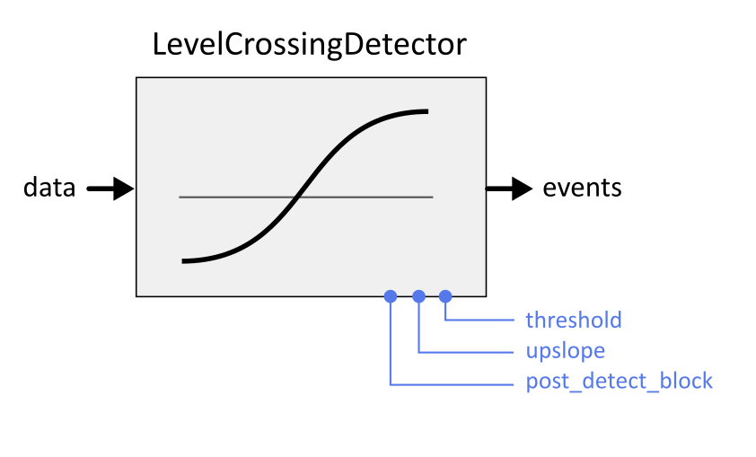

LevelCrossingDetector
=====================

Detect a threshold crossing on any of the channels in the incoming MultiChannelData stream and emits an event in response

.. list-table:: **Input port**
   :header-rows: 1

   * - port name
     - data type
     - slots
     - description
   * - **data**
     - :ref:`MultiChannelData` <double>
     - 1
     -

.. list-table:: **Input port**
   :header-rows: 1

   * - port name
     - data type
     - slots
     - description
   * - **events**
     - :ref:`EventData`
     - 1
     - A stream of events.

.. list-table:: **Options**
   :header-rows: 1

   * - port name
     - data type
     - default
     - description
   * - **threshold**
     - double
     - 0.0
     - threshold that needs to be crossed
   * - **event**
     - string
     - "threshold_crossing"
     - event to emit upon detection of threshold crossing
   * - **post_detect_block**
     - unsigned int
     - 2
     - refractory period after threshold crossing detection (in number of samples )
   * - **upslope**
     - bool
     - True
     - whether to look for upward (true) or downward (false) threshold crossings

.. list-table:: **States**
   :header-rows: 1

   * - name
     - data type
     - initial value
     - external access
     - peers access
     - description
   * - **threshold**
     - double
     - option: threshold
     - read-only
     - write/read
     - Current threshold that needs to be crossed
   * - **post_detect_block**
     - unsigned int
     - option: post_detect_block
     - read-only
     - write/read
     -
   * - **upslope**
     - bool
     - option: upslope
     - read-only
     - write/read
     -