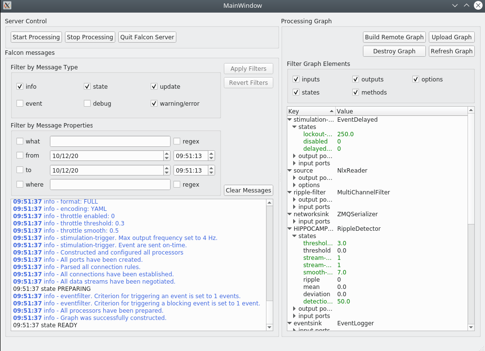

.. _generic_client:

Generic control app
===================

The falcon-client ui is used to remote control the falcon system.

If you installed the falcon conda environment, the client is already installed.
You can also install it in your conda environment:

.. code-block:: console

    conda install -c kloostermanlab falcon-clients 

The ui can be launched when the falcon program is already running.

.. code-block:: console

    usage: simple_client [-h] [--ip IP] [--port PORT] [--log LOG]

    Simple Falcon client

    optional arguments:
      -h, --help   show this help message and exit
      --ip IP      Falcon server ip-address (default: localhost)
      --port PORT  Falcon server command port (default: 5555)
      --log LOG    Falcon server cloud logging port (default: 4556)

The Falcon server needs to be launched separately. Then, when launching the falcon-client you will have to specify
the ip address and the command and cloud logging port. The communication is done through ZMQ network.

.. note::

    Once you load a graph and start the processing, you can see some green options in the graph description box. It is
    the shared state that you are allow to modify at run-time. Don't hesitate to modify them as you need.

Graph display app
=================

In the same repository as installed the previous step, you have 4 python clients :

- Plot mua stats in live with the command `live_plot_mua_stats`
- Plot behavior in live with the command `live_plot_behavior`
- Plot decoding error in live with the command `live_plot_decoding_error`
- Plot ripple stats in live with the command `live_plot_ripple_stats`
