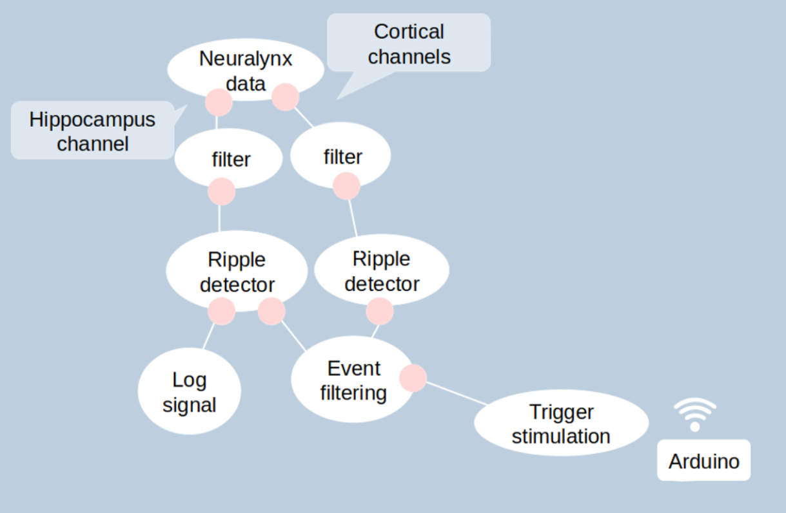
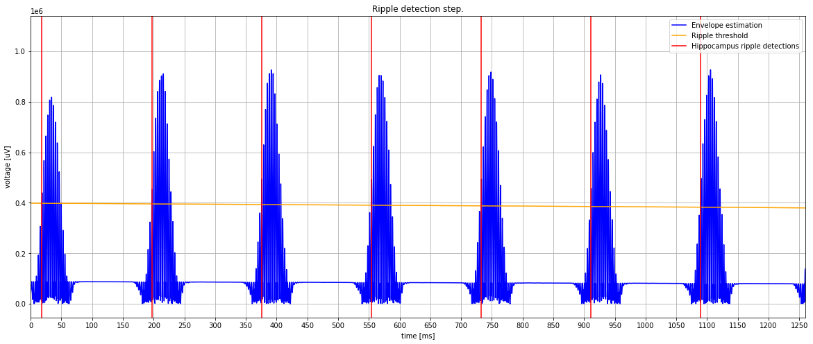

Too Long; Did not read
======================

Here, the important info as a user or as client developer to know about this use-case.

User input in real-time
.......................

Processor ripple filter (1-2) (:ref:`RippleDetector`):

- threshold dev (double)
- smooth time (double): integration time for signal statistics. Must be a positive number.
- detection lockout time (double): Current refractory period following threshold crossing that is not considered for  updating signal statistics and for event detection.
- stream events (bool)
- stream statistics (bool)

.. note:: As their is two RippleDetectors, these states are available for each processor.

Processor trigger stimulation (:ref:`EventDelayed`):

- delayed (bool) - decide if the stimulation after ripple detection should be delayed or ontime.
- detection only (bool) - decide if a stimulation event should be sent

- event trigger lockout time (double): Current refractory period following a stimulation where the signal is not
  considered for  updating signal statistics and for event detection to avoid false detection due to electrical spike generated by the stimulation.
- analysis lockout time (double): Current refractory period following a stimulation where the detection is considered but no
  stimulation is triggered to avoid over-stimulation.

Output through ZMQ network
..........................

format : (timestamps, [ statistical detector output, threshold])

