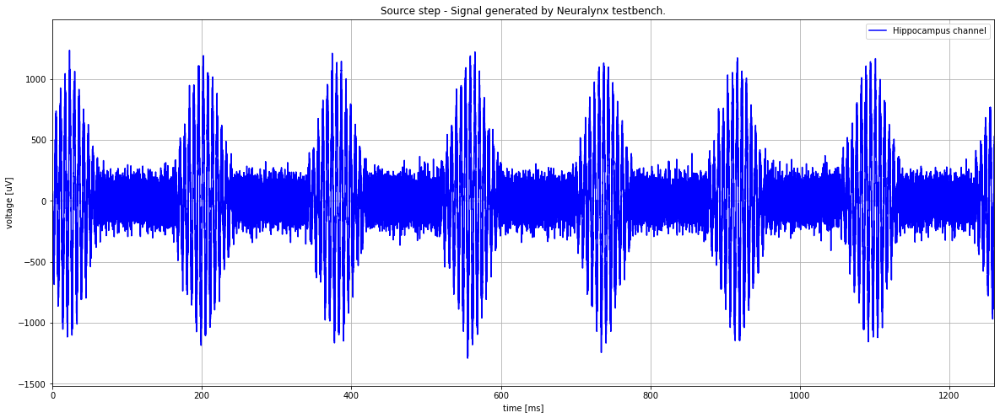
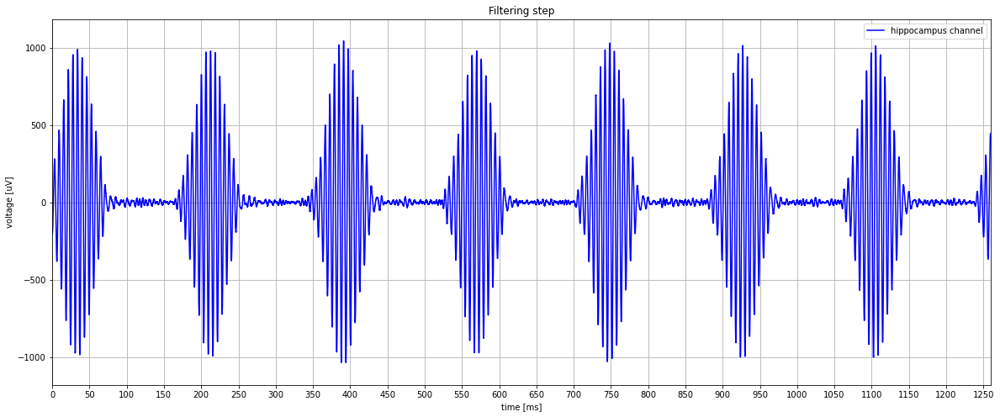
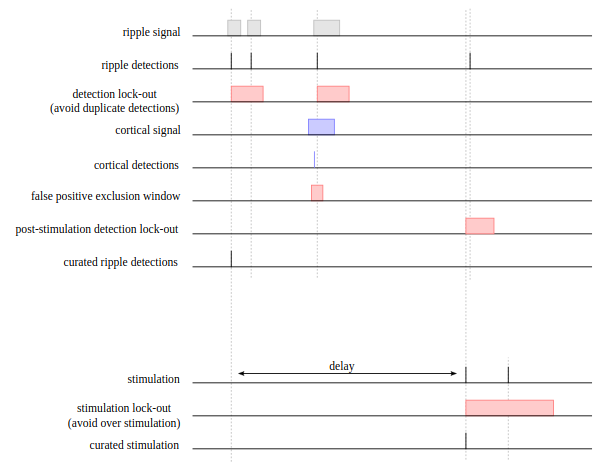

Hippocampal ripple detection
============================

Implementation
--------------

Algorithm
.........

- **Recording**: the hippocampal activity is recorded between 4 and 32 kHz depending on the type of experiment.
  Experiments that only focus on SWR are usually done at 4 kHz, whereas those that also require spikes (to look at unit activity)
  between 300 and 6000 Hz) have to be recorded at 32 kHz.

- **Filtering**: the filter is a band-pass Chebyshev type II filtering between 130 to 283 Hz and
  with transition edges of 10%. This specific design is chosen to minimise the detection of gamma bursts. The type of filter used can be change
  in the graph definition (see next page.)

- **Envelope estimation**: To reduce the computation time, the envelope is estimated using 
  the squared value of the filtered signal. While neglecting to smooth the signal may lead to
  spurious detections due to outliers, the advantage of speed of detection obtained with
  this choice outweighs the disadvantage of false detections caused by a few rare outliers.

- **Thresholding**: the threshold is constantly modified as the experiment runs.
  Indeed, it is based on statistical properties of the envelope which are the mean and the Mean Absolute Deviation (MAD).
  Every time a new value is computed (on the last time bin of 10 ms), it is added to the
  previous statistics with a predefined weight (α).

  The corresponding equations are:

  .. math::

    mean = (1  -α )* mean + α   * (mean of last time bin)
    
    MAD  = (1  - α)  * MAD + α  * |sample value  - mean|
    
    threshold = mean + arbitrary factor *MAD

  The arbitrary factor is what the user has to set for every experiment. 
  A too low threshold will detect too much noise, a too high threshold will miss the smaller ripples.

.. image:: ../images/ripple_threshold.png
   :width: 120 %

- **Trigger stimulation**: 

  There are also three modes available to deliver stimulation:

  - detection only - only detections are sent
  - ontime  - stimulation is sent immediately after detection
  - delayed - stimulation is sent after a random time (ms) uniformly chosen from a range specified by the user (see option stimulation_trigger).

  This mode can be changed while Falcon is running by modifying the delayed and detection only state.

Event filtering
...............

- **Avoid multiple detections of a single ripple using a post-detection analysis lock-out**: Usually set to 50ms in ripple
  detector, it ensures once a ripple has been detected, that no new detections or statistics update of the threshold is done. 
  - processor: hippocampus detector / cortex detector [RippleDetector]
  - options : analysis lockout time

- **Artefact removal using a cortical recording**: as the rat is moving through the environment, 
  some actions like chewing and bumping lead to artefacts in the neural signal. 
  Luckily, they are largely spread in the brain, which means we can detect them outside hippocampus. 
  This property is harnessed to ignore the (false) detections of these artefacts. 
  An electrode records the signal in the cortex (where no SWRs occur) and the ripple detection algorithm 
  is also running on it. If a hippocampus detection coincides with a cortex detection 
  it is considered as an artifact artefact and it is directly rejected.

- **Avoid overstimulation using a post-stimulation lock-out**: to limit the output stimulation frequency and avoid overstimulation,
  stimulations are not triggered in a post-stimulation window defined by the user. Usually the output stimulation frequency is limited to 2 Hz which means
  an event trigger lock-out period of 250 ms
  - processor: stimulation_trigger [EventDelayed]
  - options : event trigger lockout time/period and stimulation=True

- **Remove duplicate stimulations using a post-detection lock-out**: During a long stimulation (for example with optogenetics),
  register detection is still interesting but this lockout will be useful to avoid sending duplicate stimulation trigger
  for a stimulation already happening.
  - processor: stimulation_trigger [EventDelayed]
  - options: event trigger lockout time/period and detection=True)

- **Avoid detection of a stimulation artefact using a post-stimulation analysis lock-out**: The stimulation can add one
  or more artefacts.

  Example :

  - Electrical stimulation: One artefact appears when the stimulation occur.
  - Optogenetics stimulation: Artefacts appears due to the light at the start and a the end of the stimulation

  To avoid to assimilate it to a new ripple, an analysis lockout time, where the ripple detection is stopped in the ripple
  detector is triggered after each possible artefact times.

  - processor: stimulation_trigger [EventDelayed]
  - options: analysis lockout time/period and start_time (starting to +0 equal the start of the stimulation)

Ripple detection schema in delayed mode:

.. note:: 
  
    During the post-detection and post-stimulation detection lockout 
    all detections are discarded. However, during the post-stimulation 
    stimulation lock-out only the stimulation triggers are blocked, detections 
    are still recorded (if they do not fall within a post-detection 
    or post-stimulation detection lockout time).
