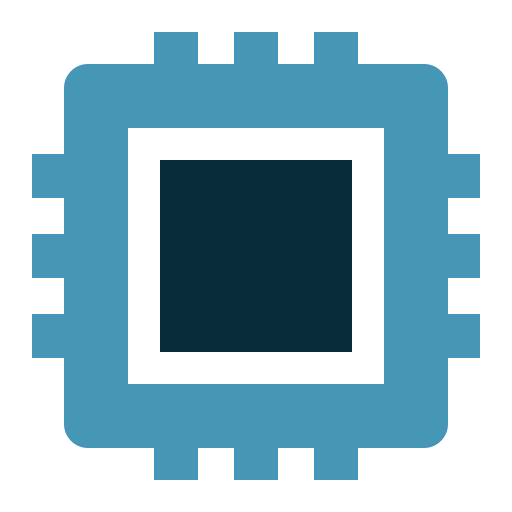
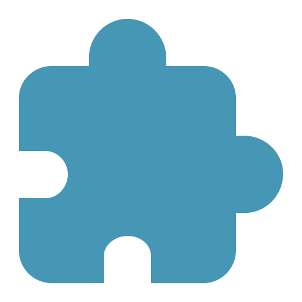

.. raw:: html

    

Documentation for Falcon Core Extensions
========================================

:Release: |release|
:Date: |today|

Falcon is a software for real-time processing of neural signals to enable
short-latency closed-loop feedback in experiments that try to causally link
neural activity to behavior. Example use cases are the detection of hippocampal
ripple oscillations or online decoding and detection of hippocampal replay
patterns.

This extension does not work as standalone and needs to be integrated with `Falcon <https://falcon-core.readthedocs.io>`_.

.. rst-class:: clearfix row

********
Overview
********

.. rst-class:: clearfix row

.. rst-class:: column column3

|lib|
.....

**Libraries**

.. rst-class:: column column3

|datatype|
..........

**Datatypes**

.. rst-class:: column column3

|processor|
...........

**Processors**

.. rst-class:: clearfix row

.. rst-class:: column column3

|hdw|
.....

**Hardware**: Acquisition system and closed-loop hardware

.. rst-class:: column column3

|tools|
.......

**Tools**: NlxTestBench and FilterTest

.. rst-class:: column column3

|resource|
..........

**Resources & Use-case**: Available Graphs and filters

.. rst-class:: clearfix row

******************
Indices and tables
******************

* `Reference API <api/library_root.html>`_
* `Content table <content_table.html>`_
* :ref:`search`

.. toctree::
   :maxdepth: 2
   :hidden:

   content_table
   datatypes
   processors
   hardware
   libs
   tools
   resource
   api/library_root

