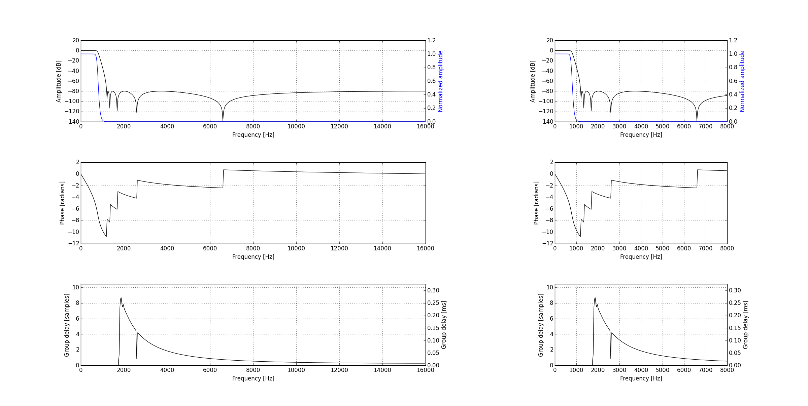
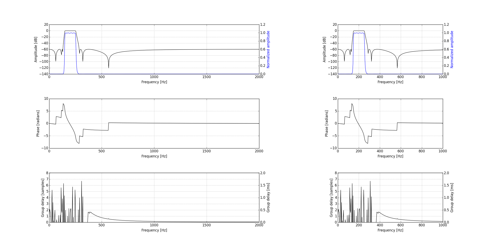
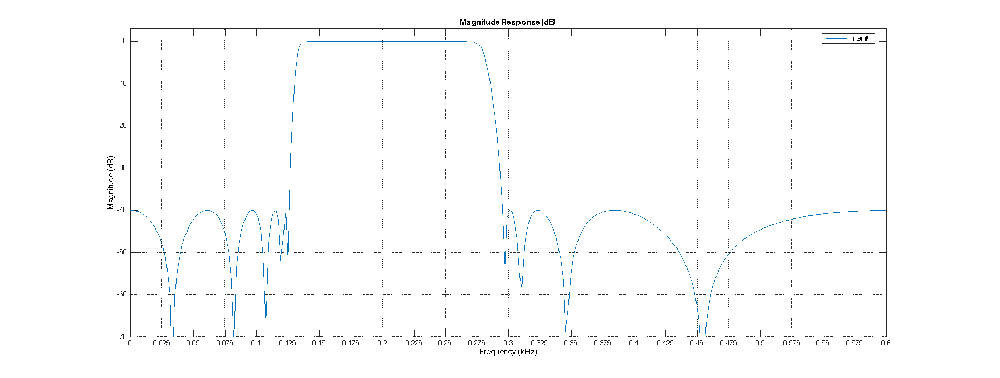
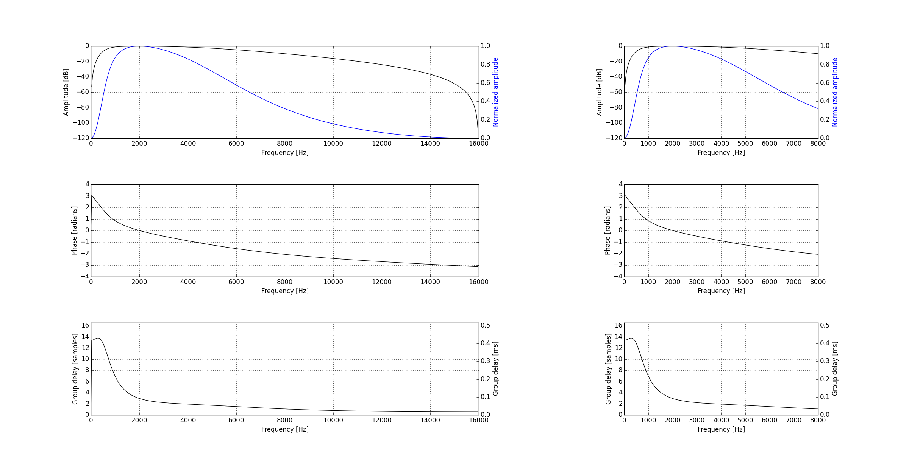

Filters
=======

A set of filters is also stored in remote side and can be accessed via the uri:

.. code-block::

    filters://path_filter_definition.filter

.. contents:: :depth: 2

.. note:: for each filter, the equivalent in numpy format is available with the name ``filter_name_ba.npy`` instead of ``filter_name.filter``.

Cheetah filter
--------------

- **name**: cheetah/spike_6k_32taps.filter
- **type**: fir
- description:
    - 32 taps high pass filter with cutoff at 6/32 times the sampling frequency
    - received from Neuralynx; same filter that is used for acquisition

IIR antialiasing
----------------

- **name**: iir_antialiasing/cheby2_antialiasing_32kHz.filter
- **type**: biquad
- description:
    - 10th order cheby2 lowpass filter with cutoffs at None - 1200 Hz (sampling frequency = 32000 Hz)
    - max ripple pass = None
    - max ripple stop = 80

IIR ripple
----------

- **name**: iir_ripple/ellip_ripple_4kHz.filter
- **type**: byquad
- description:
    - 12th order ellip bandpass filter with cutoffs at 150 - 250 Hz (sampling frequency = 4000 Hz)
    - max ripple pass = 0.1
    - max ripple stop = 60

IIR ripple low design
---------------------

Matlab implementation
*********************

- **name**: iir_ripple_low_delay/matlab_design/irr_ripple_low_delay.filter
- **type**: byquad
- description:
    - 20th order Chebyshev 2 low-ass filter with stop-bands 0-115 and 275-nyq Hz and pass-band 135-255 (sampling frequency = 32000 Hz);
    - max ripple pass = 1
    - Stop-band attenuation (1 and 2) = 40 dB

Python implementation
*********************

- **name**:  iir_ripple_low_delay/python_design/cheby2_ripple_2kHz.filter
- **type**: byquad
- description:
    - 24th order Chebyshev 2 bandpass filter with cutoffs at 115 - 275 Hz (sampling frequency = 2000 Hz)
    - max ripple pass = 1
    - max ripple stop = 40

- **name**:  iir_ripple_low_delay/python_design/cheby2_ripple_4kHz.filter
- **type**: byquad
- description:
    - 20th order cheby2 bandpass filter with cutoffs at 115 - 275 Hz (sampling frequency = 4000 Hz)
    - max ripple pass = 1
    - max ripple stop = 40

- **name**:  iir_ripple_low_delay/python_design/cheby2_ripple_32kHz.filter
- **type**: byquad
- description:
    - 8th order cheby2 bandpass filter with cutoffs at 115 - 275 Hz (sampling frequency = 32000 Hz)
    - max ripple pass = 1
    - max ripple stop = 40

IIR spike
---------

- **name**:  iir_spike/bessel_spike.filter
- **type**: byquad
- description:
    - 4th order bessel bandpass filter with cutoffs at 600 and 6000 Hz (of signal with sampling frequency = 32000 Hz)

