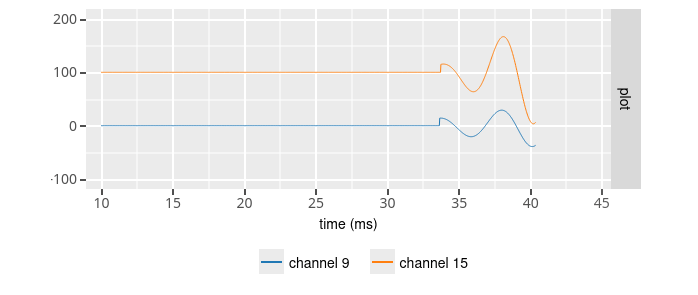
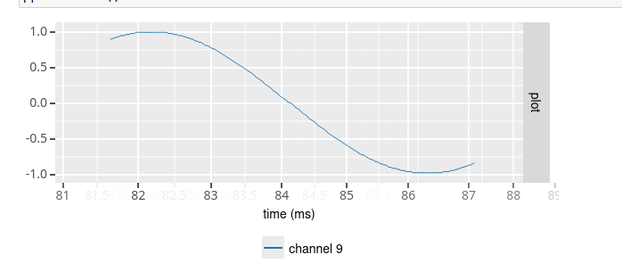
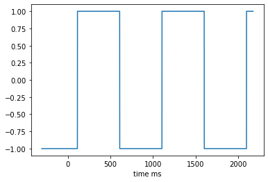

Built-in signal generators
==========================

Neuralynx raw data (nlx)
************************

To define a signal source that reads raw data packets from a previously
recorded Neuralynx raw data file, you would use the *nlx* source class and set
the *file* option to the path where the raw data file can be found.
Importantly, the raw data file should contain recorded signals from exactly
128 channels.
This is a limitation of the nlxtestbench tool that will
hopefully be removed in the future. All data packets in the file will be
streamed, unless a maximum number of data packets has been specified that is
less than the number of available data in the file (see stream options).
If the *cycle* options is set to true, then streaming of the data in the file
will restart automatically once the end of the file was reached.

Ripple signal (ripple)
**********************

The ripple signal is used to work with the ripple detection graph.
A ripple is characterize by its frequency, its mean amplitude, its duration, its zero interval between two ripples.

This configuration create a

.. code-block::

    ripple wave (fs = 32000.0 Hz, offset = 0.0 uV, noise stdev = 0.0 uV, number of channels = 128, convert byte order = 1,
    For all channels : mean ripple amplitude = 100.0 uV, ripple frequency = 200.0 Hz, ripple duration = 100 ms, zero signal interval = 50 ms
    Except for channel 9 : ripple duration = 50 ms, zero signal interval = 80 ms
    Except for channel 15 : ripple duration = 20 ms, zero signal interval = 40 ms )

Periodic signal (sine / square)
*******************************
To define a source that generates a periodic signal, you would use the
*sine* and *square* source class. You then specify the *offset*
(in microVolt), *amplitude* (in microVolt) and *frequency* (in Hz) of the
sine/square wave. In addition, you can specify a sampling rate other than
32 kHz using the *sampling_rate* option. And finally, noise may be added to
the signal by setting the *noise_stdev* option to the standard deviation of
a Gaussian noise distribution (in microVolt).

White noise (noise)
*******************

To define a source that generates white noise, you would use the *noise*
class. You can specify both the *mean* and standard deviation (*stdev*) of the
Gaussian noise distribution (in microVolt). You can specify a sampling rate
other than 32 kHz using the *sampling_rate* option.

